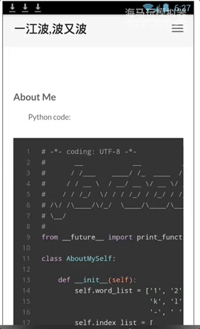

#my blog Android app
## screen gif

</img>

## useage

* IDE: Android Stdio
* Use:   
`git clone https://github.com/jarbob/My_Blog_AndroidApp.git`
then open Android Stdio and click `Import project`
* step by step to try

## demo download

[jarbob.apk](http://jarbob.com/downloads/apk/jarbob.apk)

## finally

Thanks to [@FinestWebView](https://github.com/TheFinestArtist/FinestWebView-Android)
